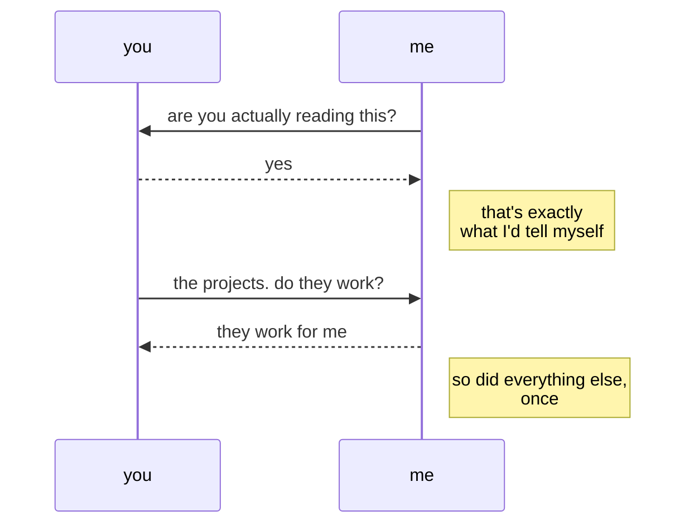

**Hey, you found me.**

*Or maybe I left the door open on purpose. Hard to say anymore.*

You probably think this is where my side projects and failed experiments *live*.

They don't.

This is where they *die*.

I won't apologise for that. You should know by now, I'm only here for the build.

Whether any of it becomes useful is mostly incidental.

<code>$ which malh</code>  
<code>**malh** not found</code>

*Everything below this point seemed like a good idea at the time.*
<!---
malh/malh is a ✨ special ✨ repository because its `README.md` (this file) appears on your GitHub profile.
You can click the Preview link to take a look at your changes.
--->
