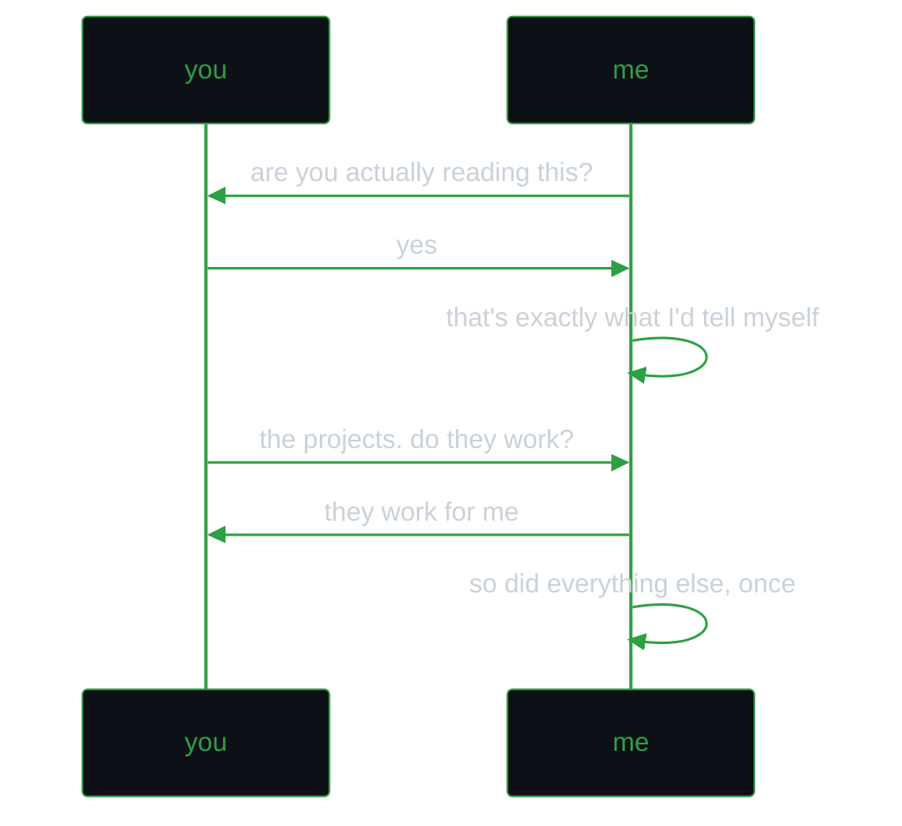

**Hey, you found me.**

Or maybe I left the door open on purpose. Hard to say anymore.

You probably think this is where my side projects and failed experiments live. In truth, this is where they die. I won't apologise for that. You should know by now, I am only here for the thrill of the build.

That thrill keeps hope alive. And hope is believing you're one magical idea away from fortune and questionable life choices.

malh

<!---
malh/malh is a ✨ special ✨ repository because its `README.md` (this file) appears on your GitHub profile.
You can click the Preview link to take a look at your changes.
--->
