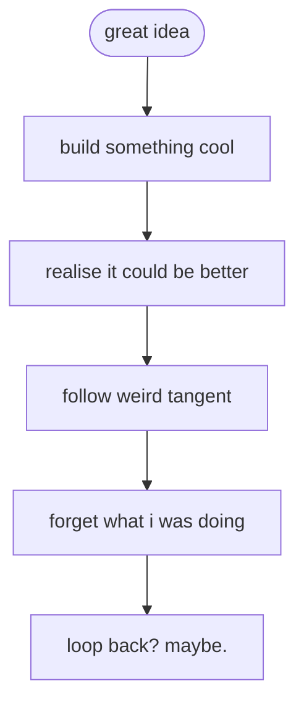

## howdy

i’m one great idea away from fortune, freedom, and a few questionable life choices.

into infrastructure, architecture, frontend design, automation, and ai.  
occasionally a bit of `<b>html</b>`.

this is where my half-built thoughts and ideas come to live.

<!---
malh/malh is a ✨ special ✨ repository because its `README.md` (this file) appears on your GitHub profile.
You can click the Preview link to take a look at your changes.
--->
